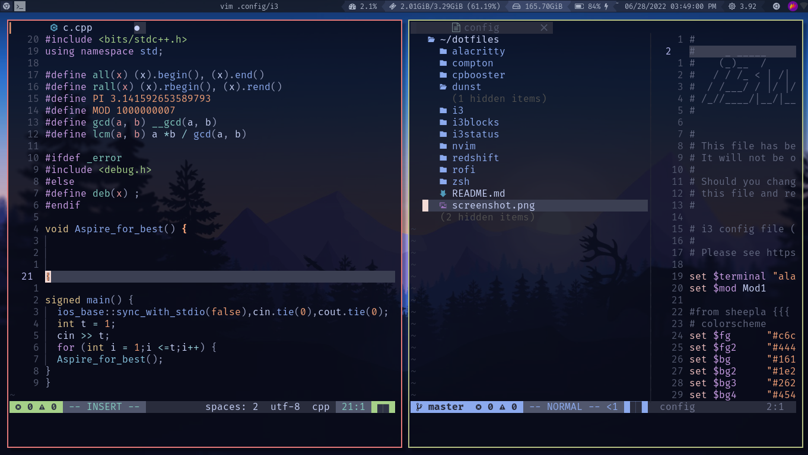

<h1 align="center">🧊 dotfiles</h1>

## Apps & Tools

### GUI

- Bar                 : 
  - [bumblebee-status](https://github.com/tobi-wan-kenobi/bumblebee-status)
- Editor              : Vim / Neovim 
- Launcher            : [rofi]( https://github.com/DaveDavenport/rofi) [THEMES!](https://github.com/sheepla/rofi-themes) 
- Notification Daemon : [dunst](https://dunst-project.org/)
- Screenshot Tool     : [flameshot](https://github.com/flameshot-org/flameshot)
- Terminal            : [alacritty](https://github.com/alacritty/alacritty)

### CLI

- Fuzzy Finder        : [fzf](https://github.com/junegunn/fzf)
- Shell               : zsh
- TUI File Manager    : [ranger](https://ranger.github.io)

## Misc

- GTK Theme           : [Arc-Theme](https://github.com/jnsh/arc-theme) `arc-theme`
- Icon Theme          : 
    - [Papirus Dark](https://github.com/PapirusDevelopmentTeam/papirus-icon-theme) `papirus-icon-theme`

- Fonts     : 
    - [FiraCode](https://github.com/tonsky/FiraCode) 

## Color Theme

Color palette from [cocopon/iceberg.vim](https://github.com/cocopon/iceberg.vim) and [gkeep/iceberg-dark](https://github.com/gkeep/iceberg-dark)
